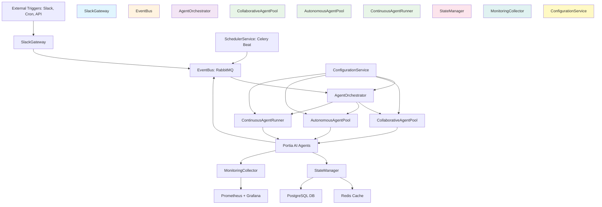

# Architectural Blueprint

## 1. Core Objective

Build a scalable, event-driven multi-agent orchestration platform in Python that manages approximately 20 specialized AI agents with heterogeneous execution patterns (collaborative, autonomous, continuous, scheduled, and event-triggered), deployed via Docker Compose for consistent local and production environments.

## 2. System Scope and Boundaries

### In Scope
- Orchestration of 20+ independent AI agents using Portia AI SDK
- Event-driven agent triggering via message broker (RabbitMQ)
- Scheduled agent execution using Celery Beat
- Continuous background agents with persistent state management
- Slack webhook integration for external event triggers
- Multi-agent collaboration workflows for complex tasks
- Docker Compose deployment configuration for all services
- Centralized logging and monitoring dashboard
- Agent registry and discovery service
- State persistence using Redis and PostgreSQL
- Configuration management via environment variables and config files

### Out of Scope
- Kubernetes orchestration (replaced by docker-compose)
- Multi-cloud deployment strategies
- Real-time streaming analytics beyond agent monitoring
- Custom LLM model training or fine-tuning
- Mobile or web UI for agent management (API-first approach)
- Multi-tenancy or user authentication (single organizational deployment)
- Live migration or zero-downtime deployments

## 3. Core System Components

| Component Name | Single Responsibility |
|---|---|
| **AgentOrchestrator** | Manages agent lifecycle (initialization, startup, shutdown) and maintains the agent registry with metadata about each agent's capabilities and execution mode |
| **EventBus** | Routes messages between agents and external systems using RabbitMQ topic exchanges with persistent message delivery |
| **SchedulerService** | Executes time-based agent tasks using Celery Beat with configurable cron expressions and interval schedules |
| **SlackGateway** | Receives Slack webhooks, validates signatures, and publishes events to the EventBus for agent consumption |
| **CollaborativeAgentPool** | Hosts agents that work together on problems using Portia AI's multi-agent plan execution with shared state |
| **AutonomousAgentPool** | Runs independent agents that perform duties in isolation without cross-agent dependencies |
| **ContinuousAgentRunner** | Manages long-running agents that process events continuously from dedicated queues |
| **StateManager** | Persists agent state, conversation history, and execution results using Redis (cache) and PostgreSQL (durable storage) |
| **MonitoringCollector** | Aggregates logs, metrics, and traces from all agents and services for observability via Prometheus and Grafana |
| **ConfigurationService** | Loads and validates agent configurations, credentials, and environment-specific settings at startup |

## 4. High-Level Data Flow

## 5. Key Integration Points

### Inter-Component Communication
- **SlackGateway ↔ EventBus**: REST webhook receiver publishes JSON payloads to RabbitMQ topic `slack.events.*` using AMQP protocol
- **SchedulerService ↔ EventBus**: Celery Beat publishes scheduled task events to RabbitMQ queue `scheduled.tasks` with priority routing
- **AgentOrchestrator ↔ Agent Pools**: Direct Python function calls to initialize agents; receives agent status via callback interfaces
- **Agent Pools ↔ Portia AI Agents**: Instantiates Portia SDK `ExecutionAgent` and `PlanningAgent` classes with configuration injection
- **Portia AI Agents ↔ EventBus**: Agents publish results and trigger other agents via RabbitMQ exchanges `agent.output.*` and subscribe to `agent.input.{agent_id}`
- **All Components ↔ StateManager**: Synchronous Redis calls for cache (TTL-based), asynchronous PostgreSQL writes for durable state using SQLAlchemy ORM
- **All Components ↔ MonitoringCollector**: Push metrics via Prometheus client library; structured JSON logs to stdout captured by Docker logging driver

### External Integrations
- **Slack API**: Incoming webhooks (HTTPS POST) and outgoing responses via `slack_sdk.webhook.WebhookClient`
- **LLM Providers**: Portia AI connects to OpenAI, Anthropic, and other providers via HTTP APIs with credential management
- **MCP Servers**: Portia AI integrates with Model Context Protocol servers for tool discovery and execution

### Data Formats
- **Event Messages**: JSON schema with fields `{event_id, event_type, timestamp, payload, metadata}`
- **Agent State**: Serialized JSON or MessagePack for complex objects stored in Redis/PostgreSQL
- **Configuration**: YAML files for agent definitions, environment variables for secrets (loaded via `python-dotenv`)

### Authentication & Security
- **Slack Webhooks**: HMAC signature verification using `slack_sdk.signature.SignatureVerifier`
- **EventBus**: RabbitMQ username/password authentication with TLS for production
- **StateManager**: Redis AUTH and PostgreSQL role-based access control
- **LLM API Keys**: Stored in environment variables, injected into Portia AI agents at runtime

### Docker Compose Orchestration
- **Service Dependencies**: ConfigurationService and StateManager start first; EventBus and SchedulerService next; Agent pools last
- **Networking**: All services communicate via Docker bridge network `agent-network` with DNS-based service discovery
- **Volume Mounts**: Configuration files mounted read-only; logs and state directories mounted read-write with named volumes
- **Health Checks**: HTTP endpoints for each service (e.g., `/health`) used by docker-compose healthcheck directives
- **Scaling**: Agent pools can be scaled horizontally using `docker-compose up --scale` for load distribution

---

**Architectural blueprint complete with 10 core components, clear data flow visualization, and comprehensive integration points. The component names defined here will be used consistently across all documents. Docker Compose replaces Kubernetes for orchestration.**
